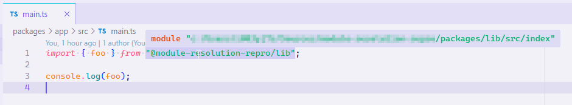

# Simple example to show missing "Build-Free Editing"

- [Announcing TypeScript 3.7 RC - TypeScript > Build-Free Editing with Project References](https://devblogs.microsoft.com/typescript/announcing-typescript-3-7-rc/#build-free-editing-with-project-references)
- [For editing experience, use source instead of .d.ts files from project references by sheetalkamat · Pull Request #32028 · microsoft/TypeScript](https://github.com/microsoft/TypeScript/pull/32028)

## How to use this repo

1. Open this repo in VS Code.
2. Install dependencies with `npm install`
   - Do not build anything ;)
3. Open [`packages/app/src/main.ts`](./packages/app/src/main.ts) and confirm that the import of `foo` is "resolved/redirected" to its source.  
    
4. Open [`packages/app/src/App.svelte`](./packages/app/src/App.svelte) and confirm that the import of `foo` is not resolved.  
    
5. Make changes to [`packages/lib/src/index.ts`](./packages/lib/src/index.ts) and see the reflected immediately in [`packages/app/src/main.ts`](./packages/app/src/main.ts).
